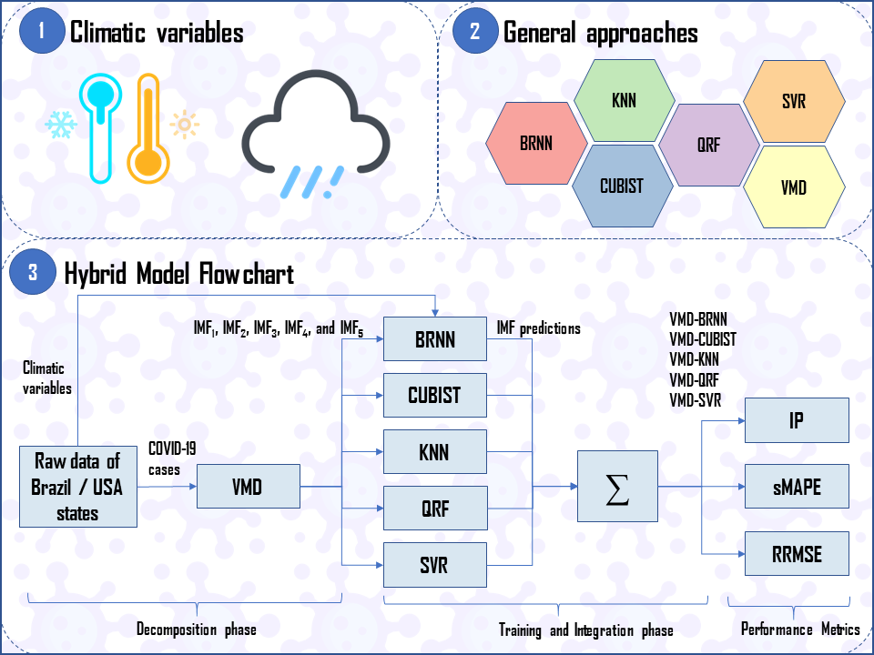

# Publication in Chaos, Solitons & Fractals Elsevier Journal
## :mask::thermometer::cloud_with_rain: Forecasting Brazilian and American COVID-19 cases based on artificial intelligence coupled with climatic exogenous variables
[</img> Ramon Gomes da Silva](https://orcid.org/0000-0001-8580-7695), [</img> Matheus H. D. M. Ribeiro](https://orcid.org/0000-0001-7387-9077), [</img> Viviana Cocco Mariani](https://orcid.org/0000-0003-2490-4568), [</img> Leandro dos Santos Coelho](https://orcid.org/0000-0001-5728-943X)



### Publication
- [Preprint (ResearchGate)](https://www.researchgate.net/publication/342247189_Forecasting_Brazilian_and_American_COVID-19_cases_based_on_artificial_intelligence_coupled_with_climatic_exogenous_variables)
- [Journal paper (ScienceDirect)](https://www.sciencedirect.com/science/article/pii/S0960077920304252)

### How to cite this paper
```bibtex
@article{dasilva2020forecasting,
    title={{Forecasting Brazilian and American COVID-19} cases based on artificial intelligence coupled with climatic exogenous variables},
    author={da Silva, Ramon Gomes and Ribeiro, Matheus Henrique Dal Molin and Mariani, Viviana Cocco and Coelho, Leandro Santos},
    journal={Chaos, Solitons \& Fractals},
    volume={139},
    pages={110027},
    year={2020},
    publisher={Elsevier},
    doi={10.1016/j.chaos.2020.110027}
}
```
